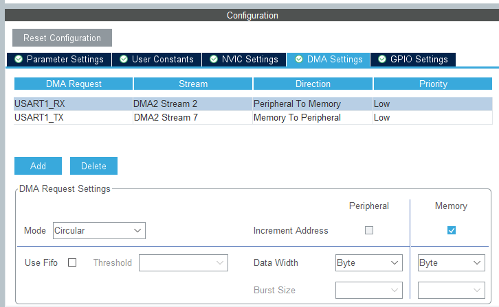

# HM-10 STM32 C++ Library

This is a fairly simple-to-use library for HM-10 bluetooth module written in C++. At this point, it contains only peripheral-mode functionality, however adding master functions should be relatively simple.

## READ FIRST - How to use

**This library is meant to be used with RTOS and DMA. I probably won't port it to non-DMA version, because it makes the communication extremely simple to handle, compared to blocking or even interrupt methods. You could try to use this library without RTOS, but be warned - any I/O will BLOCK THE WHOLE MCU (while with RTOS, it will only block the thread running it)**.

### Requirements

An STM32 microcontroller with DMA and UART that supports idle line interrupt. And a fairly new toolchain (C++14-capable).
By default, this library uses HAL but it should be fairly simple to get rid of it (if you're into that kind of things), since the communication is pretty well separated from logic. Don't ask me for that thought.

#### Requirements - provided example

The provided example is STM32CubeMX and STM32CubeIDE project. I strongly recommend that for beginners, however if you're using something else, feel free to do so. Porting instructions are below, or just browse the CubeMX config and `freertos.cpp` file.

The provided example is ready to use with STM32F4-series MCU (tested on STM32F411), however porting it to different MCU requires only changing the header in `hm10.hpp` file from `#include <stm32f4xx.h>` to the one that's provided for your MCU.

This example also uses a tiny printf library, which i strongly recommend (because stdlib implementation sometimes works, sometimes doesn't): https://github.com/mpaland/printf
**The library itself doesn't require it - it's using the stdlib implementation.**

### Including the library in your project

**The library is in [`Drivers/HM-10`](./Drivers/HM-10) directory.**

You'll need to do few things in your project to use it:

0. Update your HM-10 firmware to the newest version: http://jnhuamao.cn/download_rom_en.asp?id=1 - this library is written and tested for V709 firmware.
1. Configure UART with DMA and interrupts. DMA RX channel has to be configured in circular mode. Default baud rate of HM-10 is `115200`.

2. Turn on RTOS, create your tasks, and so on.
3. Convert your CubeMX project to C++ in STM32CubeIDE. Right-click the project in CubeIDE and select "Convert to C++". **You also will have to rename extensions of all the files with C++ code to .cpp, [along with renaming main.c to main.cpp for C++ standard compatibility - click here to read why](https://isocpp.org/wiki/faq/mixing-c-and-cpp#overview-mixing-langs)**. Ignore this point if you already have a fully working C++ project or you know what you're doing.
4. Create UART interrupt handlers - the library will enable idle line interrupt and handle everything, but you have to call it's functions inside the global handlers. You'll need to create `HAL_UART_TxCpltCallback` and put `transmitComplete()` call there, and also **manually handle the idle-line interrupt** - see [here](./Core/Src/stm32f4xx_it.c#L191),  and [here](./Core/Src/freertos.cpp#L243) - call `receiveCompleted()` in this handler.
5. Create the callbacks for data, connect and disconnect events that you'll connect to HM-10 object you'll create. They will be automatically called by library.

And that's basically it. After creating the object, call `initialize()` and check if the module responds by calling `isAlive()`.

The class documentation consists of many comments i've put in [`hm10.hpp`](./Drivers/HM-10/hm10.hpp) file. Should be enough. If not, contact me, make a issue/pull request, or whatever.
